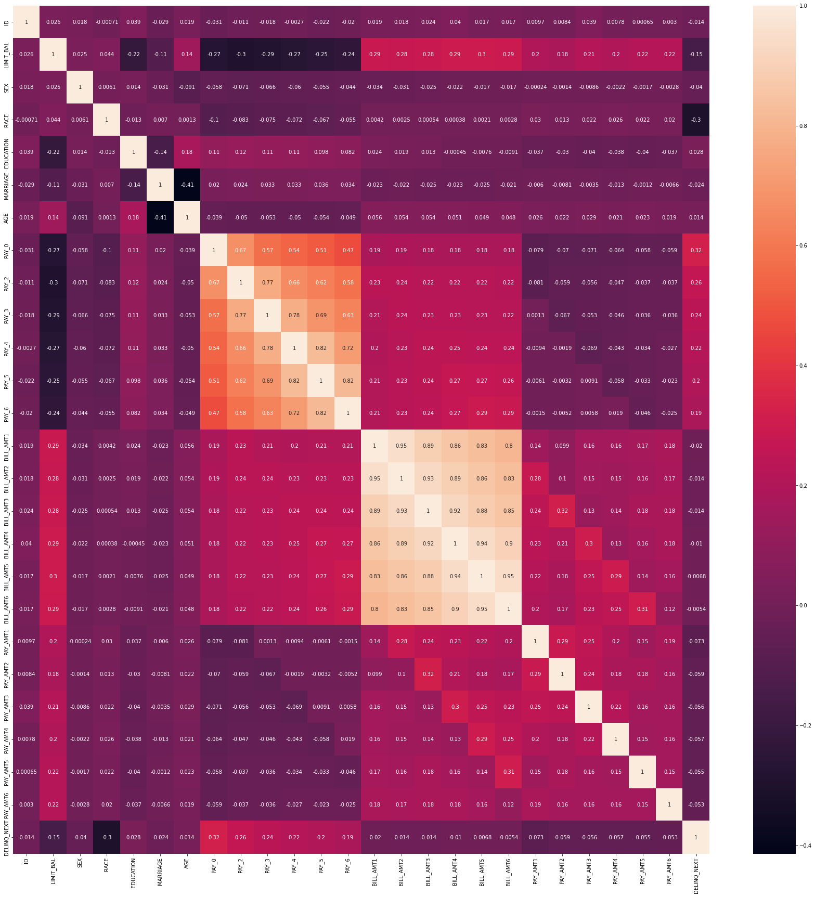

# DNSC6301 Model Card
## Basic Information
* **Person and organization developing model:**
Haoyang Wang, haoyang.wang@gmail.com <br>
* **Model data:** Aug,28,2022 <br>
* **Model version:** 1.0 <br>
* **License:** MIT <br>
* **Model implementation code:** [DNSC6301 assignment Haoyang Wang](https://github.com/whylucify1/DNSC6301/blob/main/python_6301.ipynb)<br>
<p>

## Intended Use
* <strong>Primary intended uses:</strong> This model is an example probability of default classifier, with an example use case for determining eligibility for a credit line increase.<br>
* **Primary intended users:** The profosser Johnston Hall and writer Haoyang Wang .<br>
* **Out-of-scope use cases:** Any use beyond an educational example is out-of-scope.<br>

## Training Data

* Data dictionary: 

| Name | Modeling Role | Measurement Level| Description|
| ---- | ------------- | ---------------- | ---------- |
|**ID**| ID | int | unique row indentifier |
| **LIMIT_BAL** | input | float | amount of previously awarded credit |
| **SEX** | demographic information | int | 1 = male; 2 = female
| **RACE** | demographic information | int | 1 = hispanic; 2 = black; 3 = white; 4 = asian |
| **EDUCATION** | demographic information | int | 1 = graduate school; 2 = university; 3 = high school; 4 = others |
| **MARRIAGE** | demographic information | int | 1 = married; 2 = single; 3 = others |
| **AGE** | demographic information | int | age in years |
| **PAY_0, PAY_2 - PAY_6** | inputs | int | history of past payment; PAY_0 = the repayment status in September, 2005; PAY_2 = the repayment status in August, 2005; ...; PAY_6 = the repayment status in April, 2005. The measurement scale for the repayment status is: -1 = pay duly; 1 = payment delay for one month; 2 = payment delay for two months; ...; 8 = payment delay for eight months; 9 = payment delay for nine months and above |
| **BILL_AMT1 - BILL_AMT6** | inputs | float | amount of bill statement; BILL_AMNT1 = amount of bill statement in September, 2005; BILL_AMT2 = amount of bill statement in August, 2005; ...; BILL_AMT6 = amount of bill statement in April, 2005 |
| **PAY_AMT1 - PAY_AMT6** | inputs | float | amount of previous payment; PAY_AMT1 = amount paid in September, 2005; PAY_AMT2 = amount paid in August, 2005; ...; PAY_AMT6 = amount paid in April, 2005 |
| **DELINQ_NEXT**| target | int | whether a customer's next payment is delinquent (late), 1 = late; 0 = on-time |

* **Source of training data**: GWU Blackboard, contact jphall@gwu.edu for access.
* **How training data was divided into training and validation data**: 50% training, 25% validation, 25% test
* **Number of rows in training and validation data**:
  * Training rows: 15,000
  * Validation rows: 7,500

## Test Data
* **Source of test data**: GWU Blackboard, contact jphall@gwu.edu for access.
* **Number of rows in test data**: 7,500
* **State any differences in columns between training and test data**: None

## Model details
* **Columns used as inputs in the final model**: 'LIMIT_BAL',
       'PAY_0', 'PAY_2', 'PAY_3', 'PAY_4', 'PAY_5', 'PAY_6', 'BILL_AMT1',
       'BILL_AMT2', 'BILL_AMT3', 'BILL_AMT4', 'BILL_AMT5', 'BILL_AMT6',
       'PAY_AMT1', 'PAY_AMT2', 'PAY_AMT3', 'PAY_AMT4', 'PAY_AMT5', 'PAY_AMT6'
* **Column(s) used as target(s) in the final model**: 'DELINQ_NEXT'
* **Type of model**: Decision Tree 
* **Software used to implement the model**: Python, scikit-learn
* **Version of the modeling software**: 
  * Python version: 3.7.14
  * sklearn version: 1.0.2
* **Hyperparameters or other settings of your model**: 
```
DecisionTreeClassifier(ccp_alpha=0.0, class_weight=None, criterion='gini',
                       max_depth=6, max_features=None, max_leaf_nodes=None,
                       min_impurity_decrease=0.0, min_impurity_split=None,
                       min_samples_leaf=1, min_samples_split=2,
                       min_weight_fraction_leaf=0.0, presort='deprecated',
                       random_state=12345, splitter='best')`
```
## Quantitative Analysis

* **Metrics used to evaluate final model - AUC and AIR**<br>
  * AUC: AUC reflects the validity of the model, and the higher the AUC value, the higher the validity of the model.<br>
  * AIR：Adverse impact ratio (AIR) is a quotient between protected and reference group acceptance rates.<br>
  
* **The final values of the metrics for all data:**<br>
  * Training AUC: 0.78
  * Validation AUC: 0.75
  * Test AUC: 0.74
  * Asian-to-White AIR: 1.00
  * Black-to-White AIR: 0.85
  * Female-to-Male AIR: 1.02
  * Hispanic-to-White AIR: 0.83

* **Correlation Heatmap**

 * From this heatmap we can know that AMT is highly correlated other AMT, and the payment is highly correlated with otehr payment. <br> 
 * We also can know from this plot that race has a negative correlation with the final result, it means some people will experience discrmination.<br>

* **The table of AUC Value.** <br>
 
| No | Training AUC	| Validation AUC | 5-Fold SD |
| -- | ------------ | -------------- | --------- |
| 1	| 0.645748	| 0.643880 | 0.009275 |
| 2	| 0.699912	| 0.687752 | 0.012626 |
| 3	| 0.742968	| 0.729490	| 0.017375 |
| 4	| 0.757178	| 0.741696	| 0.017079 |
| 5	| 0.769331	| 0.742480	| 0.019886 |
| 6 | 0.783722	| 0.749610	| 0.017665 |
| 7	| 0.795777	| 0.742115	| 0.022466 |
| 8	| 0.807291	| 0.739990	| 0.015567 |
| 9	| 0.822913	| 0.727224	| 0.012042 |
| 10	| 0.838052	| 0.720562	| 0.013855 |
| 11	| 0.855168	| 0.709864	| 0.010405 |
| 12	| 0.874251	| 0.688074	| 0.008073 |

From the table we can know  AUC is the highest when the depth = 6, so we choose the 6 depth to build a decision tree.<br>

* **The desicion tree.**<br>


Final decision tree model.

* **Final Iteration Plot**<br>


The relationship of three factors the Training AUC, the Validation AUC, and the Hispanic-to-White AIR. We also choose the depth = 6 because it is the best choice of the depth.
  
## Ethical considerations 

* **Describe potential negative impacts of using your model:**
    * **Math or software problems**: Accuracy is only ~70%. This means we can be wrong up to 30% of the time and this will have high costs.  
    * **Real-world risks(who, what, when or how):** According to the results of our analysis, there is a clear bias against Hispanic and Black people.<br>
* **Describe potential uncertainties relating to the impacts of using your mode.**
    * **Math or software problems**: We never know how the model will perfoirm in the future, and it needs to be monitored.<br>
    * **Real-world risks(who, what, when or how?)**: This model was not tested for privacy and security issues. <br>
* **Describe any unexpected or results**： The training data contained no missing values, which is surprising. Also, `PAY_0` appeared too important for a stable model.
